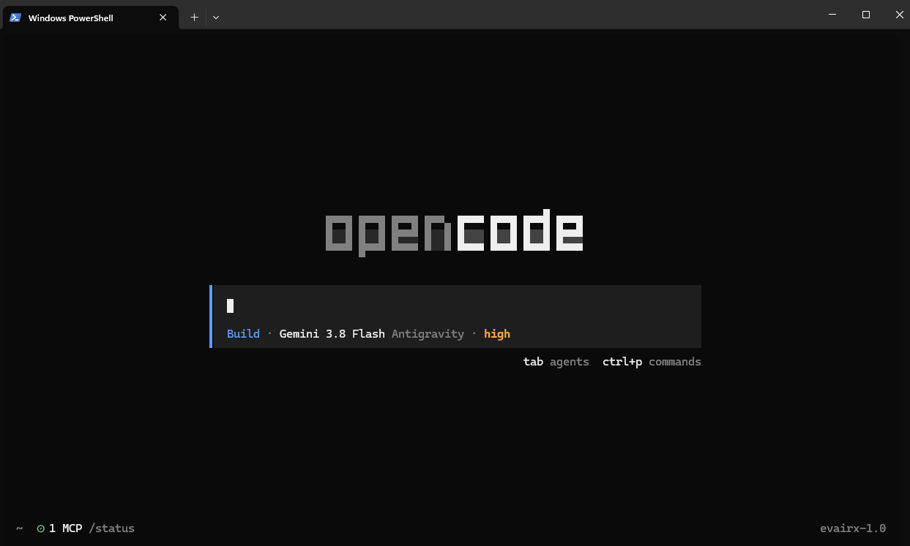
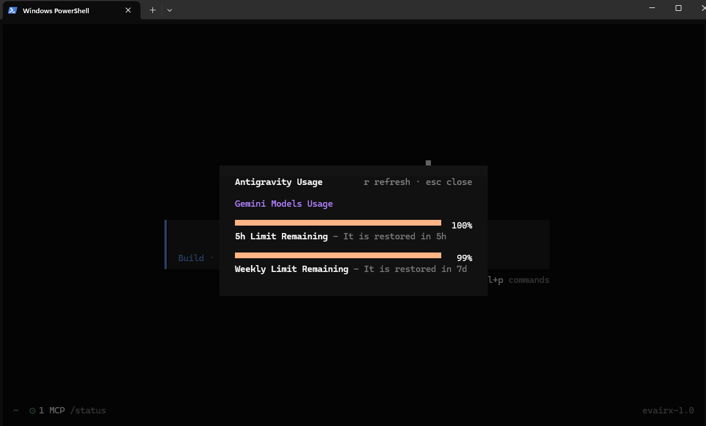

<p align="center">
  <a href="https://opencode.ai">
    <picture>
      <source srcset="packages/console/app/src/asset/logo-ornate-dark.svg" media="(prefers-color-scheme: dark)">
      <source srcset="packages/console/app/src/asset/logo-ornate-light.svg" media="(prefers-color-scheme: light)">
      
    </picture>
  </a>
</p>
<p align="center">The open source AI coding agent.</p>
<p align="center">
  <a href="https://opencode.ai/discord"></a>
  <a href="https://www.npmjs.com/package/opencode-ai"></a>
  <a href="https://github.com/anomalyco/opencode/actions/workflows/publish.yml"></a>
</p>

<p align="center">
  <a href="README.md">English</a> |
  <a href="README.zh.md">简体中文</a> |
  <a href="README.zht.md">繁體中文</a> |
  <a href="README.ko.md">한국어</a> |
  <a href="README.de.md">Deutsch</a> |
  <a href="README.es.md">Español</a> |
  <a href="README.fr.md">Français</a> |
  <a href="README.it.md">Italiano</a> |
  <a href="README.da.md">Dansk</a> |
  <a href="README.ja.md">日本語</a> |
  <a href="README.pl.md">Polski</a> |
  <a href="README.ru.md">Русский</a> |
  <a href="README.bs.md">Bosanski</a> |
  <a href="README.ar.md">العربية</a> |
  <a href="README.no.md">Norsk</a> |
  <a href="README.br.md">Português (Brasil)</a> |
  <a href="README.th.md">ไทย</a> |
  <a href="README.tr.md">Türkçe</a> |
  <a href="README.uk.md">Українська</a> |
  <a href="README.bn.md">বাংলা</a> |
  <a href="README.gr.md">Ελληνικά</a> |
  <a href="README.vi.md">Tiếng Việt</a>
</p>

> [!WARNING]
> **Este repositorio es un fork personal creado por [evairx](https://github.com/evairx).** No es el repositorio oficial de OpenCode ni representa sus releases, soporte o decisiones de desarrollo.
>
> Este fork existe para mantener integraciones y ajustes personales, entre ellos **Antigravity CLI**, **CommandCode**, cálculo de uso/precios y mejoras de la interfaz TUI. El repositorio oficial es [anomalyco/opencode](https://github.com/anomalyco/opencode). Los cambios de este proyecto se publican únicamente en el fork de [evairx/opencode](https://github.com/evairx/opencode).

[](https://github.com/evairx/opencode/releases)

[](https://github.com/evairx/opencode/releases)

---

### Installation

**evairx opencode** is compatible with the original OpenCode: it **replaces** your
global `opencode` binary and does **not** delete your config files or plugins.

Copy-paste install — Windows **CMD or PowerShell** (one line):

```powershell
powershell -ExecutionPolicy Bypass -c "irm https://raw.githubusercontent.com/evairx/opencode/dev/install.ps1 | iex"
```

Or download and run it:

```powershell
curl -fsSL -o install.ps1 https://raw.githubusercontent.com/evairx/opencode/dev/install.ps1
powershell -ExecutionPolicy Bypass -File install.ps1
```

macOS / Linux (curl):

```bash
curl -fsSL https://raw.githubusercontent.com/evairx/opencode/dev/install | bash
```

The binary is installed to `~/.opencode/bin` and `opencode` keeps working as usual.

> [!WARNING]
> This fork ships its own providers (Antigravity, Codex, CommandCode, ...) and its
> own usage/credentials handling. When you connect providers on this build, the
> **previously stored providers and credentials** of the original OpenCode build
> are **cleaned**. Your config files and plugins are preserved (backups are created
> when using `-Clean`).

### Agents

OpenCode includes two built-in agents you can switch between with the `Tab` key.

- **build** - Default, full-access agent for development work
- **plan** - Read-only agent for analysis and code exploration
  - Denies file edits by default
  - Asks permission before running bash commands
  - Ideal for exploring unfamiliar codebases or planning changes

Also included is a **general** subagent for complex searches and multistep tasks.
This is used internally and can be invoked using `@general` in messages.

Learn more about [agents](https://opencode.ai/docs/agents).

### Documentation

For more info on how to configure OpenCode, [**head over to our docs**](https://opencode.ai/docs).

### Contributing

If you're interested in contributing to OpenCode, please read our [contributing docs](./CONTRIBUTING.md) before submitting a pull request.

### Building on OpenCode

If you are working on a project that's related to OpenCode and is using "opencode" as part of its name, for example "opencode-dashboard" or "opencode-mobile", please add a note to your README to clarify that it is not built by the OpenCode team and is not affiliated with us in any way.

---

**Join our community** [Discord](https://discord.gg/opencode) | [X.com](https://x.com/opencode)
