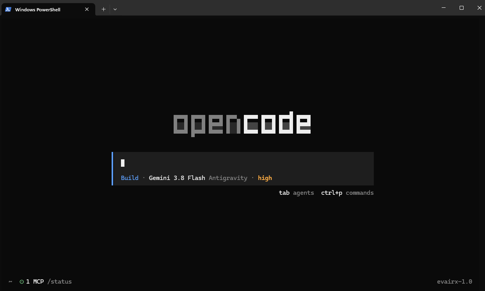
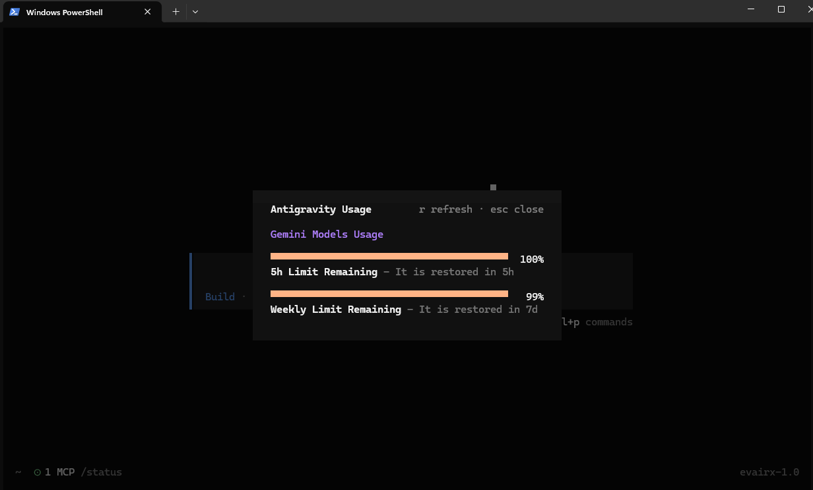

<p align="center">
  <a href="https://opencode.ai">
    <picture>
      <source srcset="packages/console/app/src/asset/logo-ornate-dark.svg" media="(prefers-color-scheme: dark)">
      <source srcset="packages/console/app/src/asset/logo-ornate-light.svg" media="(prefers-color-scheme: light)">
      
    </picture>
  </a>
</p>
<p align="center"><b>evairx opencode</b> — a personal fork of the open source AI coding agent.</p>
<p align="center">
  <a href="https://github.com/evairx/opencode/releases"></a>
  <a href="https://github.com/anomalyco/opencode"></a>
</p>

> [!IMPORTANT]
> This repository is a **personal fork** created and maintained by [evairx](https://github.com/evairx).
> It is **not** the official OpenCode repository, nor does it represent official releases, support,
> or development decisions. The upstream project lives at
> [anomalyco/opencode](https://github.com/anomalyco/opencode), and every change in this repository
> is published only on [evairx/opencode](https://github.com/evairx/opencode).

---

## What is this?

A personal `opencode` build tuned for day-to-day agentic work. It adds extra providers, keeps the
whole terminal workflow intact, and makes the **Antigravity (agy)** provider behave like a first-class
citizen inside OpenCode.

Highlights:

- **Antigravity (agy)** — Google Gemini and more through the Antigravity CLI, with usage/cost tracking
  and per-session cost reporting.
- **Plugin-aware Antigravity** — agy brings its own integrated agent prompt, so OpenCode no longer
  injects its native system prompt on top. Skills and MCP servers still reach agy:
  - Name a skill (for example `caveman`) in your message and its instructions are embedded in the
    prompt automatically, because agy cannot call OpenCode's skill tool.
  - MCP servers configured in `opencode.json` (for example the `engram` memory server) are mirrored
    into agy (`agy mcp add`) so agy can execute them inside its own tool loop. Their tool events are
    rendered in the TUI like any other tool.
- **Codex (ChatGPT)** — native Codex provider with OAuth and the same usage dialog used by Antigravity.
- **CommandCode** — an additional model provider.
- **Usage dialog** — `/usage` and `Ctrl+P` → "Usage model" show plan quotas, buckets and spend.
- **TUI polish** — provider login popups, usage lander and assorted interface fixes.

> [!WARNING]
> The Antigravity integration shells out to the official `agy` CLI and uses only its
> documented `stream-json` protocol, with authentication owned by the `agy` keyring.
> That does **not** make it compliant with Google's consumer Terms of Service: the
> current Antigravity FAQ explicitly names third-party coding agents (including
> OpenCode) as unsupported with an Antigravity product login. For a third-party
> agent Google's recommended path is an API key through Vertex AI / AI Studio.
> Use at your own risk; this build does not evade detection, alter telemetry, or
> reuse extracted OAuth tokens.

[](https://github.com/evairx/opencode/releases)

[](https://github.com/evairx/opencode/releases)

---

## Installation

Automated one-line installers are available for both **PC (Windows / Linux / macOS)** and **Android (Termux ARM64)**. Your configuration files and plugins are always preserved.

### 🖥️ PC Normal (x86_64 / x64)

> On PC, **Antigravity (Google via `agy`)**, **Codex (ChatGPT)**, **CommandCode**, Claude, OpenAI, and all other providers are **100% active and enabled**.

**Windows (PowerShell — run in PowerShell or CMD):**

```powershell
powershell -ExecutionPolicy Bypass -c "irm https://raw.githubusercontent.com/evairx/opencode/dev/install.ps1 | iex"
```

*Or download and run manually:*
```powershell
curl -fsSL -o install.ps1 https://raw.githubusercontent.com/evairx/opencode/dev/install.ps1
powershell -ExecutionPolicy Bypass -File install.ps1
```

**Linux & macOS (curl):**

```bash
curl -fsSL https://raw.githubusercontent.com/evairx/opencode/dev/install | bash
```

---

### 📱 Android / Termux (ARM64 / aarch64)

> [!NOTE]
> **Termux compatibility**: Google's `agy` CLI binary is not available for Android/Bionic libc, so **Antigravity is automatically excluded** on Termux. **Codex (ChatGPT)**, **CommandCode**, Claude, OpenAI, and all other models run natively with high performance without virtualization (`proot`).

**Full Automated One-Liner (Termux):**

Just copy and paste this command into Termux:

```bash
curl -fsSL https://raw.githubusercontent.com/evairx/opencode/dev/install-termux.sh | bash
```

*What the installer does automatically:*
1. Detects `aarch64` architecture.
2. Installs required dependency `ripgrep` via `pkg install -y ripgrep`.
3. Downloads and installs the latest Termux package or standalone binary bundle (`libopentui.so` + `opencode`).
4. Configures `$PREFIX/bin/opencode` so you can launch it immediately with `opencode`.

#### Alternative manual packages (Termux):

* **Deb package (`pkg` / `dpkg`):**
  ```bash
  curl -LO https://github.com/evairx/opencode/releases/latest/download/opencode_aarch64.deb
  dpkg -i opencode_aarch64.deb
  opencode
  ```

* **Pacman package (if using pacman in Termux):**
  ```bash
  curl -LO https://github.com/evairx/opencode/releases/latest/download/opencode-aarch64.pkg.tar.xz
  pacman -U opencode-aarch64.pkg.tar.xz
  opencode
  ```

* **Standalone ZIP:**
  ```bash
  curl -LO https://github.com/evairx/opencode/releases/latest/download/opencode-android-aarch64.zip
  unzip opencode-android-aarch64.zip
  mv opencode $PREFIX/bin/opencode
  mkdir -p $PREFIX/libexec/opencode
  mv opencode.bin libopentui.so $PREFIX/libexec/opencode/
  chmod +x $PREFIX/bin/opencode $PREFIX/libexec/opencode/opencode.bin
  opencode
  ```

---

### 🛠️ Building from source

* **PC (Windows / Linux / macOS):** From `packages/opencode`, run:
  ```bash
  bun run script/build.ts --single
  ```
* **Termux ARM64:** From the repository root, run:
  ```bash
  ./scripts/termux/build-all.sh
  ```

> [!WARNING]
> This fork ships its own providers (Antigravity, Codex, CommandCode, ...) and its own
> usage/credentials handling. When you connect a provider on this build, previously stored
> providers/credentials from the stock OpenCode build are not carried over. Your config files and
> plugins are always preserved.

---

## Agents

Two built-in agents are switchable with the `Tab` key:

- **build** — the default, full-access agent for development work.
- **plan** — a read-only agent for analysis and code exploration.
  - Denies file edits by default.
  - Asks permission before running shell commands.
  - Ideal for exploring unfamiliar codebases or planning changes.

A **general** subagent is used internally for complex searches and multi-step tasks and can be
invoked with `@general`.

---

## Documentation

Configuration is the same as upstream OpenCode: see the official [docs](https://opencode.ai/docs).

---

## Contributing

This is a personal fork — pull requests and issues go to [evairx/opencode](https://github.com/evairx/opencode).
For upstream work, read the upstream [contributing guide](https://github.com/anomalyco/opencode/blob/dev/CONTRIBUTING.md).

---

**Community** — upstream [Discord](https://discord.gg/opencode) | [X.com](https://x.com/opencode)
